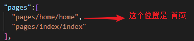
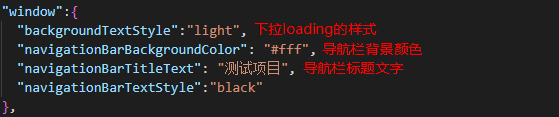
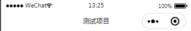
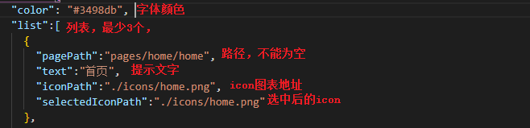
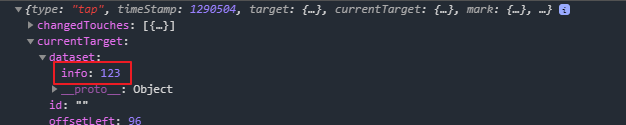

### 小程序配置文件
## app.json
**pages** -- 在微信开发者工具中创建文件路径，会自动创建文件，第一位就是 首页

**window** -- 设置小程序的状态栏，导航条，标题窗口颜色 
 

**tabBar** -- tab栏，切换显示的对应页面

## 语法
**bind** 绑定关键词 bind + 事件 tap点击
自定义传参 data-参数名={{参数值}}  {{8}} 数字类型8 ， 8 字符串8
 取值: 

 e.currentTarget.dataset.参数名;